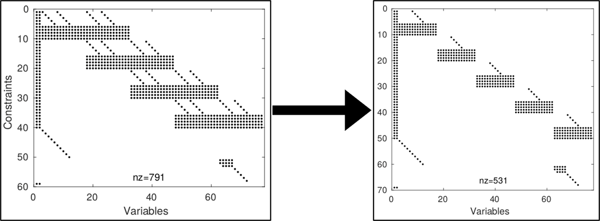
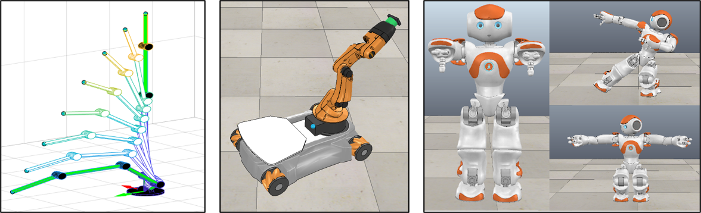

# STOPT (Sparse Trapezoidal Optimization)
Centro de investigación y de Estudios Avanzados del IPN (CINVESTAV)

**Daniel Cardona-Ortiz, Alvaro Paz and Gustavo Arechavaleta**

STOPT is a C++ library for robot trajectory optimization that builds upon numerical optimal control and Lie group methods for robot dynamics. In particular, this solver uses trapezoidal collocation and exploits the inherent sparsity of this transcription method. Moreover, efficient geometric algorithms based on Lie group and algebras dramatically reduce the number of floating-point operations to get the first-order information of the optimization problem.

The efficiency of our proposal relies on the use of Lie group methods for robot dynamics to analytically evaluate the state equations and their derivatives with recursive algorithms. Also, it is possible to enable the use of finite differences.

In order to demonstrate the scalability of this formulation three examples are build within the library, each one solves a trajectory optimization problem with different articulated robots such as a finger, a mobile manipulator and a humanoid, composed of five, eight and twenty four degrees of freedom, respectively.

This library is the result of the IEEE-ICRA-2020 paper: **"Exploiting sparsity in robot trajectory optimization with direct collocation and geometric algorithms"**
