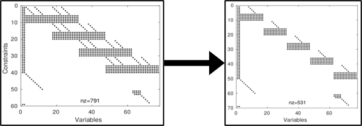

# STOPT (Sparse Trapezoidal Optimization)
Centro de investigación y de Estudios Avanzados del IPN (CINVESTAV)

**Daniel Cardona-Ortiz, Alvaro Paz and Gustavo Arechavaleta**

STOPT is a C++ library that presents a robot trajectory optimization formulation that builds upon numerical optimal control and Lie group methods. In particular, this solver uses trapezoidal collocation and exploits the inherent sparsity of this method and the efficiency of geometric algorithms based on Lie algebras to dramatically reduce the number of floating-point operations to get the first-order information of the problem.

The efficiency of our proposal lies in the use of geometric algorithms to analytically evaluate the state equations and their derivatives with recursive algorithms and perform the constructuction of the first order information in an analitical way. 

In order to demonstrate the scalability of this formulation three examples are build within the library, each one demonstrate the efficiency with different articulated robots such as a finger, a mobile manipulator and a humanoid, composed of five, eight and twenty four degrees of freedom respectively.

This library is related to the IEEE-ICRA-2020 paper: **"Exploiting sparsity in robot trajectory optimization with direct
collocation and geometric algorithms"**
